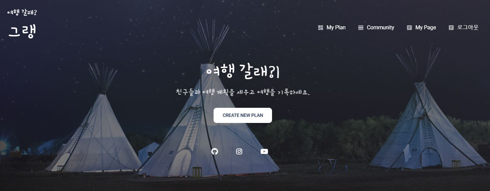
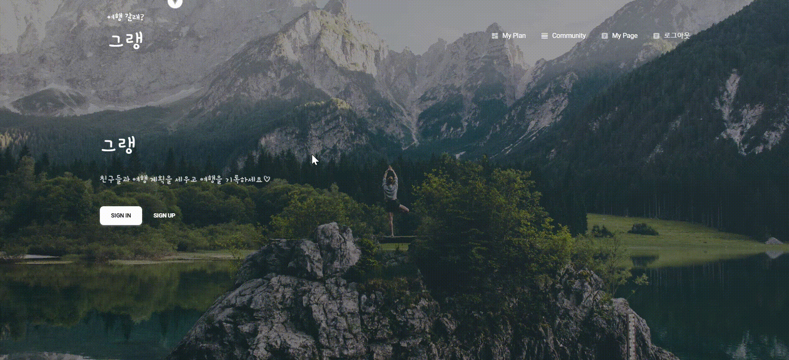
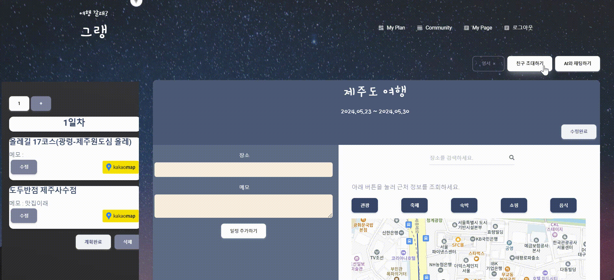
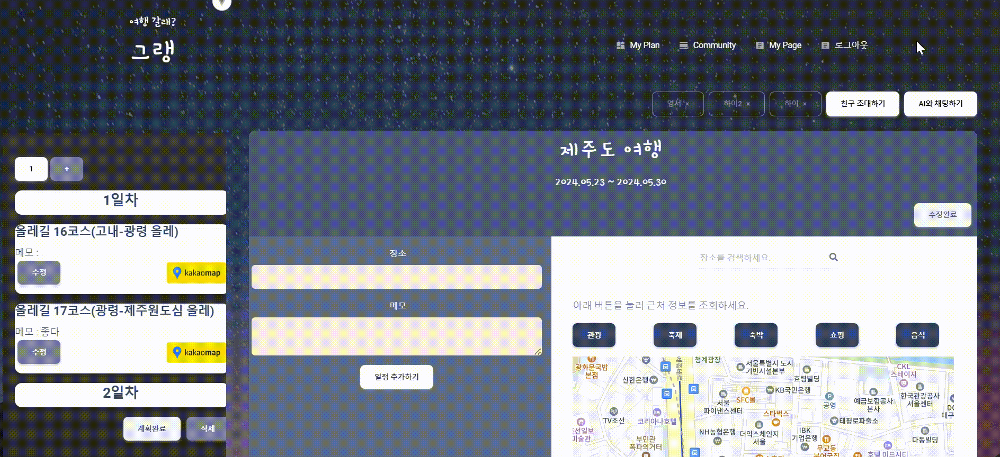
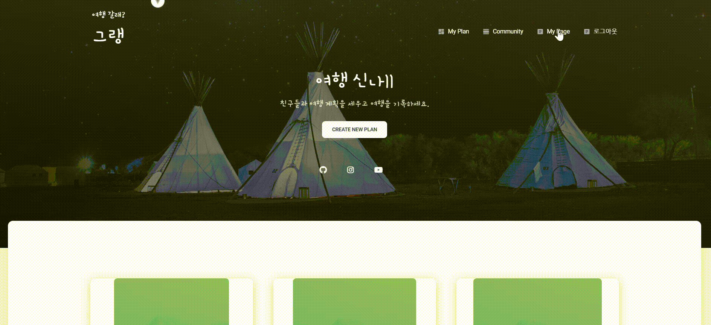
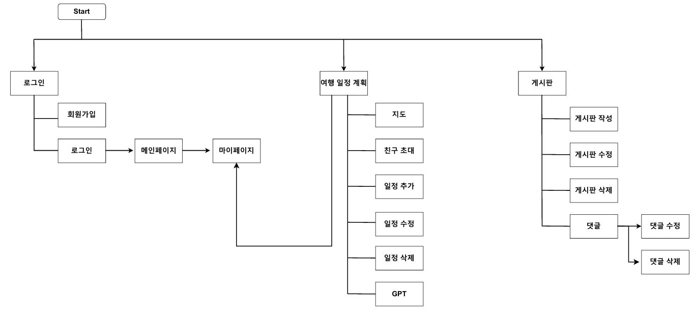
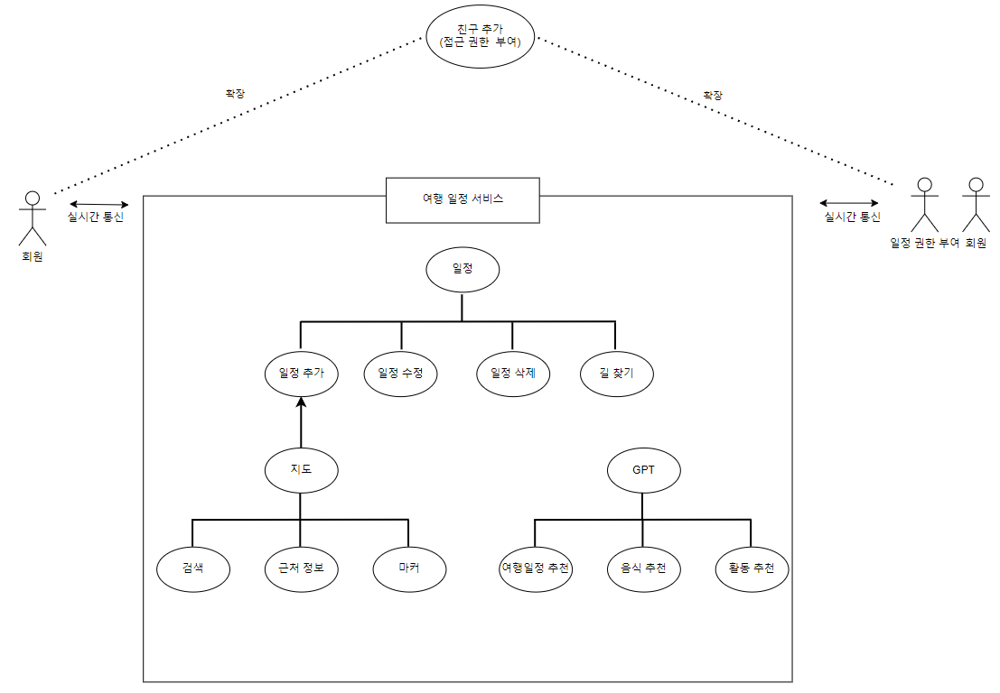
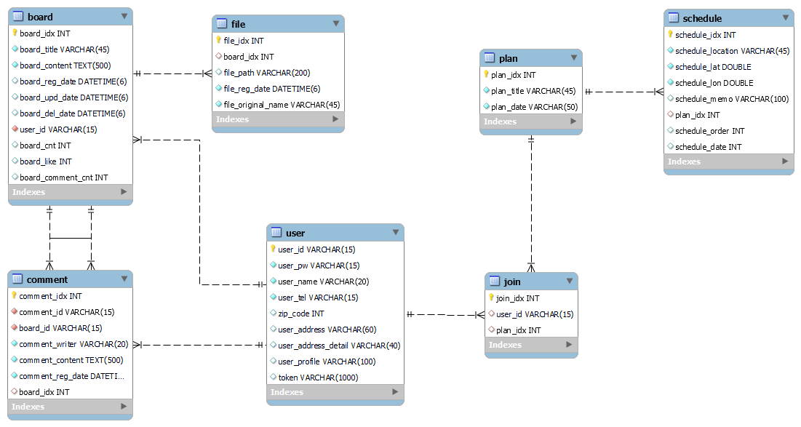

# 그랭

### 여행 일정 관리 웹앱

### :bulb: 시연 영상

↑ 클릭하면 시연 영상을 볼 수 있어요!

## 🚩 목차

1. 기획 배경
2. 서비스 소개
3. 시연
4. 기술 스택
5. 프로젝트 일정 및 기타 산출물

## :sparkles: 기획 배경

#### 개요

- 한 줄 설명 : 친구와 여행 일정을 계획하고 기록할 수 있는 "여행 일정 관리 서비스"
- 서비스 명 : **그랭**

#### 목적

- **필요한 기능만 담아 친구와 실시간으로 편집**
- **관광할 여행지에 대한 정보가 부족한 경우 여행 계획자는 관련 정보 획득의 부담을 지도와 카테고리를 통해 줄여줌**
- **길찾기 서비스와 식당 숙소 등의 정보들을 통해 일정과 동선을 짜는데 간편화 제공**

#### 현 상황

- **TRIPLE이라는 앱이 있지만 다른 기능이 많아서 여행 계획 및 기록용으로 어려움**
- **굿노트 여행 플래너 웹은 직접 검색해서 찾거나 일정이 변경되면 관리가 어려의 문제발생**

## :sparkles: 서비스 소개

#### 사용자   
- 여행 계획을 여행지에 대한 정보 없이 지도를 통해 세울 수 있다
- 친구 초대를 통해 친구와 계획을 공유 하며 실시간으로 계획을 수정할 수 있다
- 게시판을 통해 게시물과 댓글 작성, 수정, 삭제를 할 수 있다

#### 서비스 시퀀스

1. 로그인을 한 사용자가 여행일정을 작성한다
2. 원하는 여행지를 검색 또는 지도를 통해 위치를 확인할 수 있다
3. 지도를 통해 보여지는 마커로 여행 계획에 추가할 수 있다
4. 드래그를 통해 일차별로 계획을 수정할 수 있다
5. AI와 채팅을 통해 여행지, 식당, 숙소 등을 추천 받을 수 있다 
6. 친구 초대를 통해 같이 여행일정을 실시간으로 알려주며 계획 할 수 있다.
7. 친구와 사용자는 완료된 여행일정을 추후에도 수정하며 계획할 수 있다 
8. 메인페이지에서 유튜브 또는 블로그를 통해 여행을 추천 받을 수 있다.

#### 기대 효과

- 친구들과 실시간 편집 – Miscommunication 감소, 편리한 일정 관리
- 관광지 데이터, Youtube, 블로그 등 다양한 API – 정보 선별 비용 절약
- 추후 여행 관련 업체와 협업하여 예약, 결제 등 사용자에게 편리한 서비스 제공 가능

## :sparkles: 시연

##### Login & Profile

##### Main

→ 메인 페이지로 유튜브와 가고 싶은 여행지를 검색하여 여행지를 추천받을 수 있습니다

##### Invite

→ 친구를 초대함으로써 실시간으로 친구와 여행일정을 수정할 수 있습니다
 

##### Gpt

→ GPT를 통해 여행지에 대해 추천받을 수 있습니다

##### Socket

→ 소켓 통신으로 여행일정에 추가된 친구와 실시간으로 계획을 수정할 수 있습니다

##### Commuity

→ 게시판과 댓글 기능으로 작성, 수정, 삭제가 가능합니다

##### My Page

→ 프로필 수정과 계획하고 있는 여행일정을 다시 볼 수 있습니다

## :sparkles: 기술 스택

- 프론트엔드 : npm 10.5.0, vue 3.4.27
- 백엔드 : Java 11.0.17, Spring boot 3.2.5, Swagger 2.5.0, MySQL 8.0.32
- 이슈관리 : Git

## :sparkles: 프로젝트 기타 산출물

#### Flow Chart

#### Usecase Diagram

**여행 일정 계획**

#### ERD

